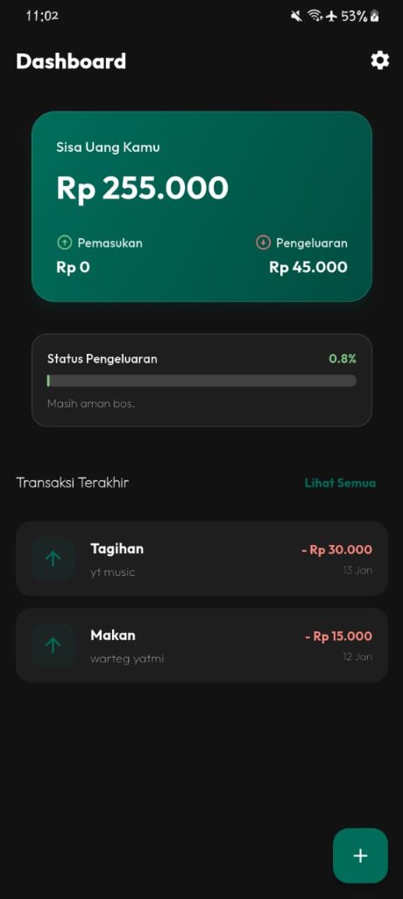
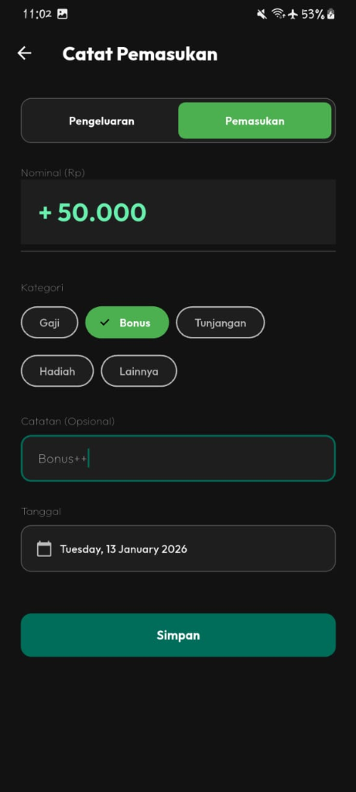
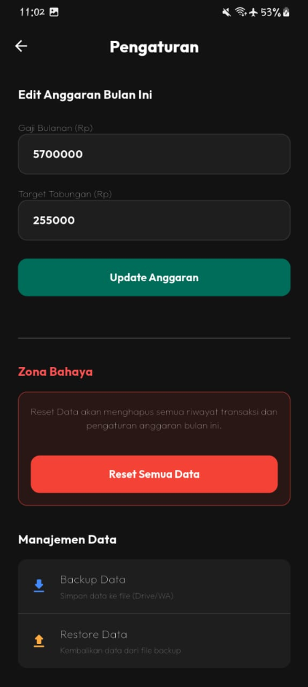

# ECash - Premium Finance Tracker 💰

**ECash** is a modern, offline-first personal finance application built with Flutter. It helps users track their monthly budget, monitor expenses, and achieve savings targets with a premium, "Sultan" feel.

Designed with a focus on privacy and user experience, ECash operates entirely offline with local database storage and manual backup options.

## ✨ Key Features

- **📊 Smart Dashboard:** Real-time view of your Income, Expenses, and Current Savings.
- **🎯 Budget Sync:** Set a savings target, and the app calculates your daily budget automatically.
- **🛡️ Offline & Private:** All data is stored locally using SQLite. No internet required.
- **💾 Backup & Restore:** Export your data to Google Drive/WhatsApp and restore it anytime to prevent data loss.
- **💎 Premium UI/UX:**
  - **HD Design:** Crystal clear typography and "Deep Teal" aesthetic.
  - **Smooth Physics:** iOS-style bouncing scroll and zoom page transitions.
  - **Edge-to-Edge:** Immersive experience with transparent system bars.
  - **Haptic Feedback:** Satisfying ripple effects on interaction.
- **🚫 Crash-Proof:** Built-in global error handling to prevent "Red Screen of Death" crashes.

## 🛠️ Tech Stack

- **Framework:** Flutter (Dart)
- **State Management:** Riverpod 2.0
- **Database:** Drift (SQLite)
- **Design System:** Google Fonts (Outfit), Custom Material 3 Theme
- **Utilities:** `share_plus` (Export), `file_picker` (Import), `intl` (Formatting)

## 🚀 Installation

1.  **Clone the repository:**
    ```bash
    git clone https://github.com/yourusername/ecash.git
    ```
2.  **Install dependencies:**
    ```bash
    flutter pub get
    ```
3.  **Run with code generation (first time):**
    ```bash
    dart run build_runner build --delete-conflicting-outputs
    ```
4.  **Run on device:**
    ```bash
    flutter run --release
    ```

## 📸 Screenshots

| Dashboard | Add Expense | Settings |
|:---------:|:-----------:|:--------:|
|  |  |  |

## 🤝 Contributing

Contributions are welcome! Feel free to submit a Pull Request.

## 📄 License

This project is licensed under the MIT License.
